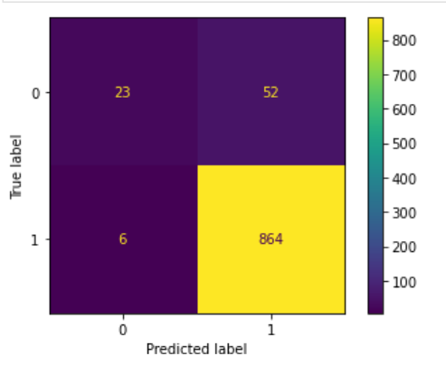
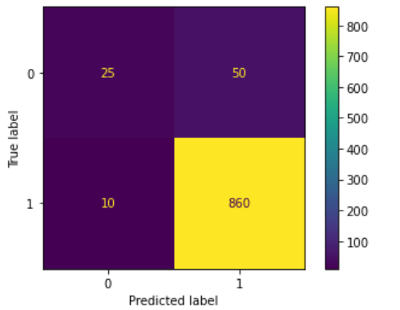

# Alexa Review Sentiment Analysis

This project performs sentiment analysis on Amazon Alexa product reviews. The analysis involves data exploration, visualization, and building a machine learning model to predict the sentiment of reviews.

## Table of Contents
- [Introduction](#introduction)
- [Data Overview](#data-overview)
- [Exploratory Data Analysis](#exploratory-data-analysis)
- [Sentiment Analysis](#sentiment-analysis)
- [Model Building](#model-building)
- [Results](#results)
- [Conclusion](#conclusion)
- [Installation](#installation)
- [How to use](#Howtouse)

## Introduction

This project aims to analyze customer reviews of Amazon Alexa products to determine overall sentiment and trends. The analysis includes visualizations to understand the distribution of ratings and the length of reviews.

## Data Overview

The dataset used in this project consists of reviews for Amazon Alexa products, including the following features:
- `rating`: The rating given by the customer.
- `date`: The date of the review.
- `variation`: The variation of the product.
- `verified_reviews`: The text of the review.
- `feedback`: Indicates whether the review is positive (1) or negative (0).

## Exploratory Data Analysis

### Rating Distribution
The distribution of ratings is visualized using a bar plot.


### Variation Distribution
The count of each product variation is shown in the bar plot below.


### Length of Reviews
The distribution of the length of reviews is shown using a histogram.


### Word Cloud
Word clouds for positive and negative reviews highlight the most frequent words in each category.


## Sentiment Analysis

Sentiment analysis is performed using the `feedback` column, which indicates whether a review is positive or negative.

## Model Building

The machine learning model is built using the following steps:
1. **Text Preprocessing**: Cleaning and transforming the text data.
2. **Feature Extraction**: Using `CountVectorizer` to create a bag-of-words model.
3. **Model Training**: Training a Random Forest classifier,XGBoost Classifier,Decision Tree Classifier.

### Model Performance
The performance of the model is evaluated using accuracy metrics and a confusion matrix.

Random Forest classifier Confusion Matrix.




XGBoost Classifier Confusion metrix.




Decision Tree Classification Confusion Matrix.


## Results

   **Randomforest**
- **Training Accuracy**: 99.41%
- **Test Accuracy**: 93.86%


  **XGBoost**
- **Training Accuracy**: 97.00%
- **Test Accuracy**: 93.43%


    **DecisionTree**
- **Training Accuracy**: 99.41%
- **Test Accuracy**: 90.58%

  
The model performs well in classifying positive and negative reviews.

## Conclusion

This project demonstrates how to perform sentiment analysis on customer reviews using text preprocessing, feature extraction, and machine learning. The visualizations help in understanding the data distribution and the effectiveness of the model.

## Installation

To install the required packages, use the following command:
```bash
pip install -r requirements.txt.
```
## HOW TO RUN

Step 1: Clone the repository
```
git clone https://github.com/1073rajan/Sentiment-Analysis-Alexa.git
```

Step 2: Open the cloned repository and create a conda environment. Activate the new environment
```
conda create -n amazonreview python=3.10
```
```
conda activate virtualenv
```

Step 3: Install the requirements file
```
pip install -r requirements.txt
```

Step 4: Run the app
```
flask --app api.py run
```

Step 5: The app will run on port 5000. 
```
localhost:5000
```
